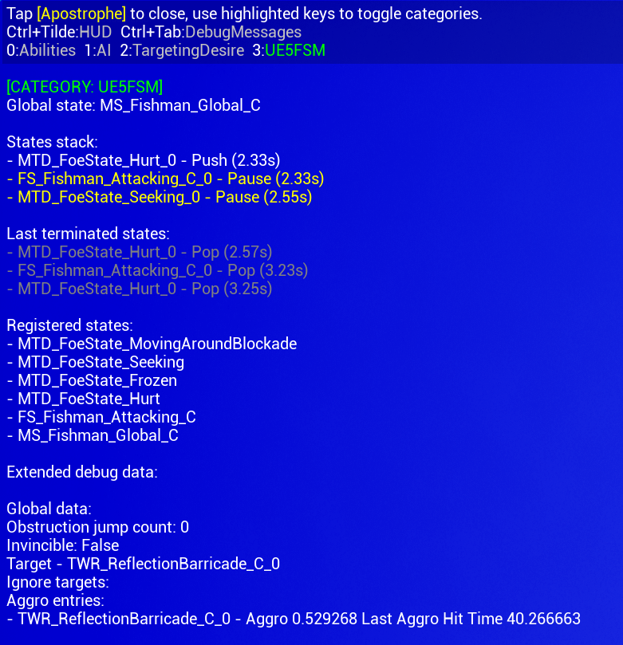

# Debug tools

The plugin comes with a few tools you can use in order to debug your state machines.

## Gameplay Debugger

The simplest one is the gameplay debugger. All you have to do is press `'` (apostrophe) while looking at the actor
containing the finite state machine, and then enable the UE5FSM category using your numpad (look at the number
nearby the category name).

After enabling it, you'll be presented with the global state, normal states stack along their current state, the 
time that passed since it took place, and all the registered states. You also get the last terminated states due to 
either end or pop event.

Along all that you have extended debug data at the very bottom that you can fill yourself to fit your own game needs.
On the screenshot you can see an example of my game, but it will be empty by default.



To add your very own debug data to the gameplay debugger you have one single method:

```c++
FString UMachineState::GetDebugData() const;
```

The implementation can look something like:

```c++
FString UMyMachineState::GetDebugData() const
{
	FString ReturnValue = "";

	ReturnValue.Appendf(TEXT("My very important data to debug: %s\n"), TEXT("The root of evil"));
	ReturnValue.Appendf(TEXT("My very important data to debug 2: %d\n"), TEXT("Just a peaceful number"));

	return ReturnValue;
}
```

Note that global state debug data will be displayed above every other state.

## Logging

There are many ways of changing the verbosity, but we'll be showing the two simplest ones.

To temporarily change the verbosity use this command in the console editor:

```
-LogCmds="LogFiniteStateMachine YOUR_VERBOSITY_LEVEL"  
```

To change the verbosity permanently (unless un-done) you can add the following to your `DefaultEngine.ini`:

```
[Core.Log]
LogLogFiniteStateMachine=All # You can use Warning, Log, Verbose etc.
```

To enable an even higher level of verbosity which might be required for very in-depth debug purposes you can define the
`FSM_EXTREME_VERBOSITY` in your `MY_MODULE.Build.cs`:

```
PublicDefinitions.Add("FSM_EXTREME_VERBOSITY");
```
